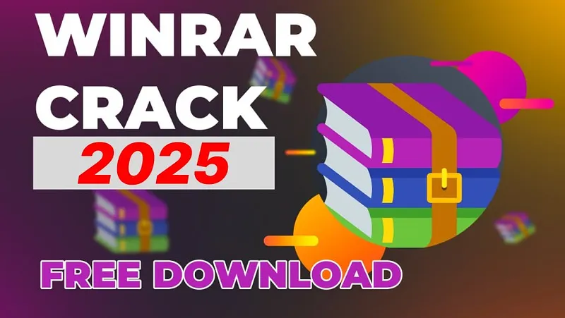

# 🚀 **winrar password cracker** | **rar crack**

Imagine transforming your workflows with unparalleled precision and efficiency. **winrar password cracker** is a cutting-edge solution designed to elevate software quality and reliability, empowering you to achieve more with less effort. With its robust features and seamless integration capabilities, **winrar password cracker** ensures that every project meets the highest standards of performance and dependability.

Ready to experience the future of development? Click below to get started!  

## 🛡️ Trust and Reliability with **winrar password remover**

When it comes to **winrar password remover**, trust and reliability are at the heart of everything we do. We understand that security is not just a feature—it's a promise. Here’s why you can rely on **winrar password remover** for your needs:

### Software Security Measures
We take software security seriously, implementing advanced protocols to safeguard your data. Our system leverages state-of-the-art encryption techniques and multi-layered protection mechanisms to ensure maximum security.

- **End-to-end encryption**: Protects your sensitive information from unauthorized access.
- **Secure authentication**: Ensures only authorized users gain access to critical systems.
- **Regular vulnerability assessments**: Actively monitor and address potential threats.

### Data Protection and Privacy
Your privacy is paramount. **winrar password remover** adheres to strict data protection standards, ensuring your personal and business data remains confidential and secure.

- **Compliance with global regulations**: Including GDPR and CCPA.
- **Transparent data handling practices**: Clearly communicate how your data is used and protected.
- **User-controlled permissions**: You decide who gets access to your information.

### Regular Security Updates
Staying ahead of emerging threats is crucial. That's why **winrar password remover** provides **regular security updates** to keep your software fortified against vulnerabilities.

- **Automated patch management**: Ensures timely updates without manual intervention.
- **Proactive threat monitoring**: Identifies and mitigates risks before they become issues.

### Safe Download Process (**rar crack**)
Downloading **winrar password remover** is as safe as it gets. With our **rar crack** process, you can rest assured that every installation is verified and secure.

- **Digital signatures**: Confirm the authenticity of each download.
- **Anti-malware scanning**: Ensures files are free from malicious content.
- **Step-by-step guidance**: Makes the process simple and transparent.

### Proven Track Record
Our commitment to excellence has earned us a reputation for reliability. Thousands of satisfied users worldwide trust **winrar password remover** for their daily operations.

- **Years of experience**: Demonstrating consistent performance and innovation.
- **Positive user feedback**: Backed by testimonials and high satisfaction ratings.
- **Industry recognition**: Awards and partnerships with leading organizations.

Ready to experience the unmatched security and reliability of **winrar password remover**? Get started today!

## Benefits of Using **winrar key**

✨ **Professional Software Capabilities**  
- **winrar key** offers cutting-edge **rar password crack** features that cater to both beginners and advanced users, ensuring top-notch performance for all your projects. With robust tools designed for precision, it empowers you to achieve professional results effortlessly.  

✅ **User-Friendly Interface**  
- The intuitive design of **winrar key** ensures a seamless experience, even for first-time users. Its streamlined layout simplifies navigation, allowing you to focus on creativity rather than complexity.  

🔄 **Regular Updates and Improvements**  
- Stay ahead with frequent updates that introduce new functionalities and enhance existing ones. Our commitment to continuous improvement ensures that **winrar key** remains at the forefront of **rar password crack** technology.  

📞 **Technical Support Availability**  
- Need assistance? Our dedicated support team is always ready to help, providing prompt solutions to any issues you may encounter. With reliable support, you can trust **winrar key** to meet all your software needs.  

---

## Getting Started with **winrar key**

Welcome to the world of **winrar key**! Below is a step-by-step guide to help you get started quickly and effortlessly. Follow these actionable steps to download, install, configure, and use **winrar key** for your first project.

---

### Steps to Start Using **winrar key**

1. 📥 **Download and Installation**
   - Visit the official website or repository of **winrar key**.
   - Download the latest stable release suitable for your operating system.
   - Run the installer and follow the on-screen instructions to complete the installation process.

2. 🔧 **Initial Setup**
   - Launch **winrar key** after installation.
   - Create a new project or open an existing one based on your requirements.
   - Configure the environment by selecting the appropriate settings for your workflow.

3. ⚙️ **Basic Configuration**
   - Navigate to the settings menu and adjust the **rar password crack** options as needed.
   - Ensure all dependencies are installed and properly linked to **winrar key**.
   - Save your configuration to apply the changes.

4. 🚀 **First Use Guide**
   - Explore the user interface to familiarize yourself with the tools and features.
   - Try running a simple test case to ensure everything is set up correctly.
   - Refer to the documentation for advanced functionalities and troubleshooting tips.

---

---

### Ready to Dive In?

Use **winrar key** today to streamline your projects and enhance productivity. Don't forget to explore additional resources for more in-depth learning.

